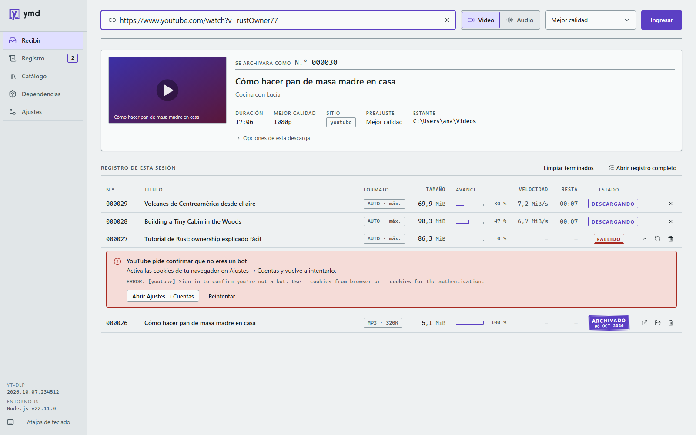
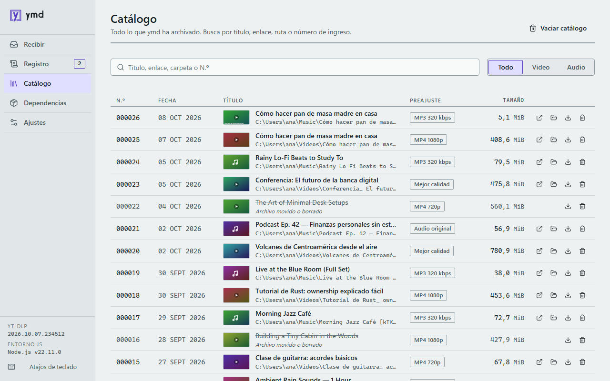
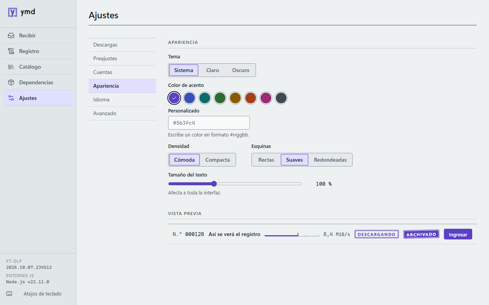

<div align="center">

<picture>
  <source media="(prefers-color-scheme: dark)" srcset="docs/assets/ymd-logo-dark.svg">
  
</picture>

<p><strong>A desktop app to download video and audio with yt-dlp.</strong></p>

[](https://github.com/galexbh/ymd/actions/workflows/ci.yml)
[](https://github.com/galexbh/ymd/releases/latest)
[](LICENSE)


[Download](https://github.com/galexbh/ymd/releases/latest) ·
[Changelog](CHANGELOG.md) ·
[Contributing](CONTRIBUTING.md) ·
[Español](README.md)

</div>

<picture>
  <source media="(prefers-color-scheme: dark)" srcset="docs/assets/screenshot-receive-dark.png">
  
</picture>

## Features

- **Video and audio:** MP4, MKV or WebM with a configurable maximum quality; extraction to MP3, M4A, Opus or FLAC.
- **Playlists:** whole or selected entries.
- **Download queue:** parallel downloads with progress, speed and time remaining; cancel and retry.
- **Catalog:** searchable history with quick access to each file and its folder.
- **Post-processing:** embedded thumbnail, metadata and subtitles; SponsorBlock.
- **Editable presets**, each with its own destination folder.
- **Managed dependencies:** installs and updates yt-dlp, ffmpeg and Deno in a per-user folder, verified with SHA-256.
- **Cookies and accounts:** a companion extension for Brave, Chrome and Edge; Firefox cookies; `cookies.txt` import; credentials kept in the OS keychain.
- **Copied-link detection** from the clipboard, configurable.
- **Error diagnosis** for yt-dlp failures, with the action that fixes them.
- **Themes:** light and dark, with configurable accent color, density and text size.
- **Signed automatic updates.**
- **Spanish and English** interface.

<table>
  <tr>
    <td width="50%">
      <picture>
        <source media="(prefers-color-scheme: dark)" srcset="docs/assets/screenshot-catalog-dark.png">
        
      </picture>
    </td>
    <td width="50%">
      <picture>
        <source media="(prefers-color-scheme: dark)" srcset="docs/assets/screenshot-appearance-dark.png">
        
      </picture>
    </td>
  </tr>
  <tr>
    <td align="center">Catalog</td>
    <td align="center">Appearance</td>
  </tr>
</table>

## Installation

Download the latest version from [Releases](https://github.com/galexbh/ymd/releases/latest).

| Platform            | File                                    | Notes                                      |
| ------------------- | --------------------------------------- | ------------------------------------------ |
| Windows 10/11 (x64) | `ymd_<version>_x64-setup.exe`           | Per-user install, no administrator rights. |
| macOS 11+           | `ymd_<version>_universal.dmg`           | Universal: Apple Silicon and Intel.        |
| Linux (x64)         | `ymd_<version>_amd64.AppImage` / `.deb` |                                            |

> [!NOTE]
> The Windows installer is not Authenticode-signed yet, so SmartScreen may show a warning the first time. Choose **More info → Run anyway**.

On first launch, the welcome screen installs what ymd needs. From then on ymd keeps its dependencies and itself up to date.

## Dependencies

ymd downloads its tools to `%LOCALAPPDATA%\ymd\bin` (Windows) or to its data folder (macOS and Linux); nothing is installed system-wide. The location can be changed in **Settings → Advanced**.

| Tool                                                                                     | Purpose                                        | Source                                                                                                 |
| ---------------------------------------------------------------------------------------- | ---------------------------------------------- | ------------------------------------------------------------------------------------------------------ |
| [yt-dlp](https://github.com/yt-dlp/yt-dlp)                                               | Download engine                                | Official executable, verified against `SHA2-256SUMS`; stable, nightly or master channel                |
| [FFmpeg](https://ffmpeg.org/)                                                            | Stream merging, conversion and post-processing | [yt-dlp/FFmpeg-Builds](https://github.com/yt-dlp/FFmpeg-Builds) (Windows and Linux), Homebrew on macOS |
| [Deno](https://deno.com/)                                                                | JavaScript runtime yt-dlp needs for YouTube    | Node, Bun or QuickJS are used if already installed                                                     |
| [aria2](https://aria2.github.io/), [AtomicParsley](https://github.com/wez/atomicparsley) | Optional                                       | Installed from the Dependencies screen                                                                 |

## Cookies and accounts

Some videos can only be downloaded while signed in. ymd offers several opt-in options:

- **ymd Cookies extension** for Brave, Chrome and Edge: syncs the cookies of the sites you choose over Native Messaging, with no network involved. On Windows this is the recommended path for Chromium browsers. See [`extension/README.md`](extension/README.md).
- **Browser cookies** (Firefox recommended on Windows) or an imported **`cookies.txt`** file.
- **Site accounts**, stored in the OS keychain and handed to yt-dlp through `--netrc-cmd`.

Passwords are never written to disk or passed as process arguments. The cookie file lives in the user's private data folder and can be deleted from **Settings → Accounts**.

## Development

Requirements: Node 22+, stable Rust and, on Linux, the [Tauri 2 prerequisites](https://v2.tauri.app/start/prerequisites/).

```sh
corepack enable
pnpm install

pnpm tauri dev        # run the app in development mode
pnpm dev:mock         # UI only, in the browser, against a simulated backend
pnpm test             # UI tests
pnpm e2e              # end-to-end tests (Playwright)
pnpm ext:build        # ymd Cookies extension
pnpm tauri build      # installers in src-tauri/target/release/bundle
```

Rust tests run with `cargo test --features test-support` inside `src-tauri/`. The full guide, conventions and release process are in [CONTRIBUTING.md](CONTRIBUTING.md).

### Layout

| Path         | Contents                                                                             |
| ------------ | ------------------------------------------------------------------------------------ |
| `src/`       | User interface (React 19, TypeScript)                                                |
| `src-tauri/` | Backend (Rust, Tauri 2): queue, dependencies, authentication, history                |
| `extension/` | ymd Cookies extension (Manifest V3)                                                  |
| `e2e/`       | End-to-end tests                                                                     |
| `docs/`      | Technical documentation, such as the [cookie bridge protocol](docs/cookie-bridge.md) |

## License

ymd is released under the [MIT License](LICENSE).

The **ymd** name and logo identify the official project and are not covered by the license; derived projects must use their own name and logo.

yt-dlp ([Unlicense](https://github.com/yt-dlp/yt-dlp/blob/master/LICENSE); its executables bundle GPLv3+ components) and FFmpeg (GPL) are not included in the installer: ymd downloads them from their official sources when used.

## Disclaimer

ymd is not affiliated with YouTube or any other site. Respect each site's terms of service and only download content you have the right to keep.

## Acknowledgements

[yt-dlp](https://github.com/yt-dlp/yt-dlp), [FFmpeg](https://ffmpeg.org/), [Deno](https://deno.com/), [Tauri](https://tauri.app/), [React](https://react.dev/) and [Lucide](https://lucide.dev/).
